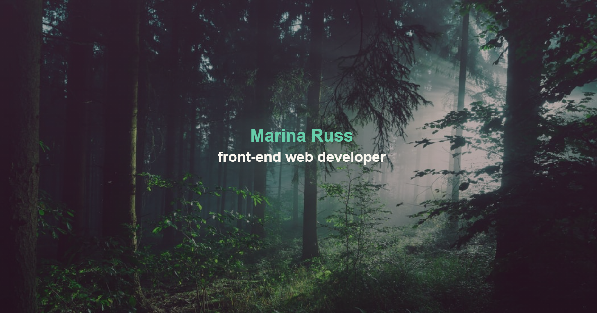

# Welcome to Marina Russ' Portfolio!

## 📃 Purpose:

This site highlights some of the websites and web applications that I have made to help give you an idea of what I am capable of!

[Deployed Portfolio Site](https://marina-russ.github.io/)

## 🎨 Features:
* mobile-responsive layout
* **coming soon**: *animation effects*
* sticky nav once user passes the hero image
* <code>:hover</code> effects
* playful use of <code>box-shadow</code>

### 🖥️ Website:

### ❤️ Credits:
* #013 Heavy Rain Gradient [webgradients](webgradients.com)
* Forest background [Sebastian Unrau](https://unsplash.com/photos/sp-p7uuT0tw)
